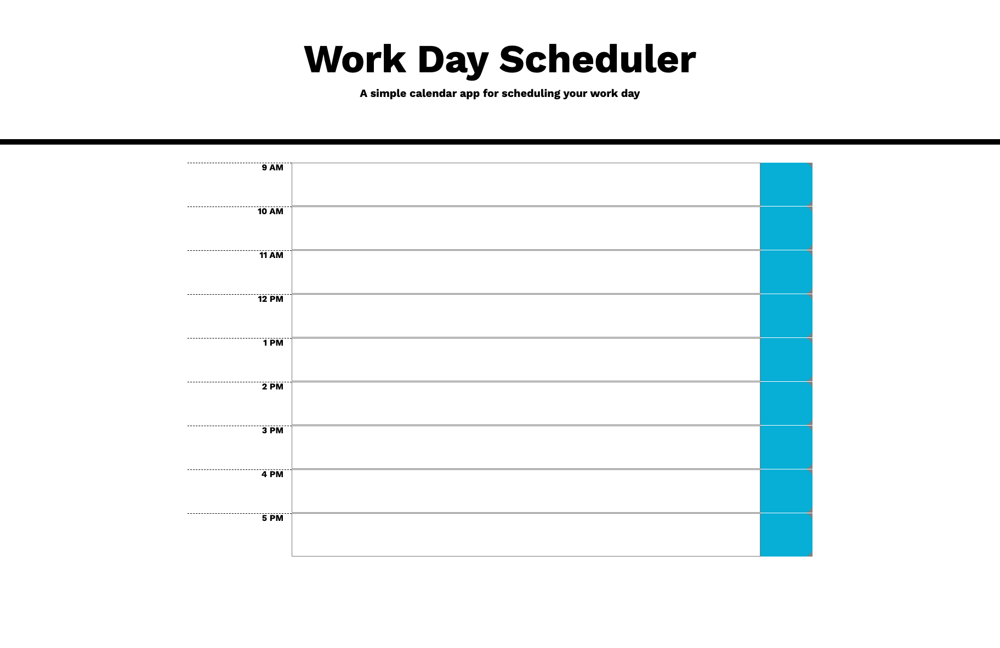

# SK_Homework_5 Work Day Scheduler

Assignment:

Create a simple calendar application that allows a user to save events for each hour of the day by modifying starter code. This app will run in the browser and feature dynamically updated HTML and CSS powered by jQuery.

You'll need to use the Moment.js library to work with date and time. Be sure to read the documentation carefully and concentrate on using Moment.js in the browser.

Credit:

Classmates and tutoring helped with functions

Deployment:

https://github.com/samkilpatrick903/SK_Homework_5
https://samkilpatrick903.github.io/SK_Homework_5/

Screenshot:

